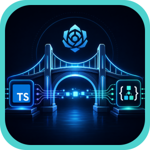
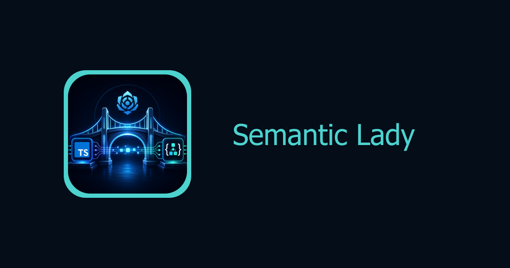

<div align="center">



# Semantic Lady

Schema unification SDK for generative media model APIs.

### One generation schema across image and video models.

<br />

<strong>Project details</strong>

[](#babysea-oss-taxonomy)
[](#status)
[](LICENSE)

<br/>

<strong>Checks</strong>

[](https://gitlab.com/babysea/semantic-lady/-/commits/main)
[](https://dl.circleci.com/status-badge/redirect/circleci/2uTLcwc4naeNuKDP41es88/PgdP4SEoNsCeJGSKgZ7Shq/tree/main)
[](https://codecov.io/github/babysea-community/semantic-lady)
[](https://github.com/babysea-community/semantic-lady/actions/workflows/sentry-check.yml)
[](https://github.com/babysea-community/semantic-lady/actions/workflows/codeql.yml)
[](https://github.com/babysea-community/semantic-lady/actions/workflows/package-check.yml)

<br/>

<strong>Built with</strong>

[](https://www.npmjs.com/package/semantic-lady)
[](https://nodejs.org)
[](https://www.typescriptlang.org)

<br/>



</div>

<br/>

## BabySea OSS taxonomy

BabySea open source projects are organized into three categories:

[](#babysea-oss-taxonomy)
[](#babysea-oss-taxonomy)
[](#babysea-oss-taxonomy)

| Category      | Description                                                                                                                                        |
| :------------ | :------------------------------------------------------------------------------------------------------------------------------------------------- |
| **SDK**       | Typed developer entry points that applications import directly. Semantic Lady is an SDK because it ships local model/schema resolver APIs.         |
| **Primitive** | Reusable infrastructure boundaries extracted from BabySea's execution control plane. Each primitive focuses on one system concern.                 |
| **Starter**   | Deployable reference applications that combine product UI, auth, storage, and generative media execution patterns. Some starters may include billing. |

## Status

BabySea OSS projects are published into three status levels:

[](#status)
[](#status)
[](#status)

| Status         | Description                                                                                                                                                                          |
| :------------- | :----------------------------------------------------------------------------------------------------------------------------------------------------------------------------------- |
| **Working**    | Fully implemented and usable. All documented capabilities function as described. Suitable for personal and small-team use. No breaking-change guarantees between versions.          |
| **Production** | Working plus a hardened public runtime contract. Validated against a stated infrastructure stack with deterministic behavior, explicit failure modes, and a documented upgrade path. |
| **Alpha**      | Early-stage implementation. Core structure exists but some capabilities may be incomplete, undocumented, or subject to breaking changes. Not recommended for production deployments. |

## Table of contents

1. [Overview](#1-overview)
   - [What this is](#what-this-is)
   - [Short version](#short-version)
   - [Production lineage](#production-lineage)
   - [Grounding rule](#grounding-rule)
   - [Adoption path](#adoption-path)
2. [Schema contract](#2-schema-contract)
3. [Terminology](#3-terminology)
4. [Boundaries](#4-boundaries)
5. [Architecture](#5-architecture)
6. [Quick start](#6-quick-start)
   - [Install](#install)
   - [List models](#list-models)
   - [Resolve a model schema](#resolve-a-model-schema)
   - [Build UI controls](#build-ui-controls)
7. [Core capabilities](#7-core-capabilities)
   - [What it normalizes](#what-it-normalizes)
   - [Model ordering](#model-ordering)
   - [Schema tiers](#schema-tiers)
   - [BYOK usage](#byok-usage)
8. [Version surface](#8-version-surface)
9. [Security and Compliance](#9-security-and-compliance)
10. [Community](#10-community)
    - [Who's using it](#whos-using-it)
    - [Related projects](#related-projects)
    - [Contributing](#contributing)
11. [License](#11-license)


## 1. Overview

### What this is

`semantic-lady` is a local TypeScript SDK for resolving generative media model schemas into one normalized `generation_*` field contract.

It helps BYOK products, workflow builders, and community tools present many provider models through one consistent schema vocabulary without calling BabySea, running a backend, or wrapping provider SDKs.

### Short version

Different inference providers name the same ideas differently. Semantic Lady exposes a resolved catalog where public API model IDs, provider model IDs, UI names, field names, field types, defaults, enum values, placeholders, and schema tiers are normalized for application code.

### Production lineage

Semantic Lady is extracted from the schema work used to make BabySea and BabyChain handle provider growth without hard-coding every UI and request shape by hand. The public SDK exposes the normalized contract and canonical provider model identifiers, not BabySea's private schema compiler or provider payload mapper.

### Grounding rule

Public OSS behavior is limited to local schema discovery and schema resolution. The package ships model metadata and normalized `generation_*` fields. It does not submit generations, store credentials, call provider APIs, call BabySea APIs, choose providers, price workloads, or manage execution.

### Adoption path

Install the SDK, list available image/video models, resolve the schema for the selected model, render fields in your UI, collect user input, then pass that input to your own BYOK provider integration.

## 2. Schema contract

| Surface       | Contract                                                                                           |
| :------------ | :------------------------------------------------------------------------------------------------- |
| Model names   | Stable API names such as `bfl/flux-2-pro`, provider model IDs such as `flux-2-pro`, and user-facing UI names for pickers and labels. |
| Model groups  | Separate image and video model arrays, plus one combined array ordered by provider and API name.    |
| Fields        | Normalized `generation_*` names such as `generation_prompt`, `generation_aspect_ratio`, and media inputs. |
| Field shape   | Type, required flag, default, enum values, min/max, placeholder, description, and schema tier.      |
| Schema views  | `core`, `advanced`, and `full` views for compact UI controls or complete model forms.              |

The public package is data plus local resolver helpers. It is safe to use in server-side code, build tools, CLIs, and browser bundles where the generated catalog size is acceptable.

## 3. Terminology

| Term                  | Meaning in this package                                                                                 |
| :-------------------- | :------------------------------------------------------------------------------------------------------- |
| Semantic model        | One supported image or video model with an API name, UI name, provider, workflows, and resolved schema. |
| API name              | Stable model identifier used by application code, for example `google/veo-3.1-fast`.                    |
| Provider model        | Canonical provider-side model identifier used by BYOK adapters, for example `veo-3.1-fast-generate-preview`. |
| UI name               | Human-readable model label for menus and forms.                                                         |
| Normalized field      | A provider-neutral field named with the `generation_*` prefix.                                           |
| Core schema           | The fields most users need first, ordered for predictable UI rendering.                                  |
| Advanced schema       | Less common controls, ordered alphabetically after core fields.                                          |
| BYOK                  | Bring your own key: your application owns provider credentials and provider execution.                   |

## 4. Boundaries

- Not a hosted API, backend client, or network SDK.
- Not a provider SDK wrapper and not a generation submission tool.
- Not a credential store, proxy, queue, pricing engine, or provider router.
- Not BabySea's private schema compiler, raw provider-doc parser, private alias map, or provider payload mapper.
- Not a replacement for your BYOK integration. It gives your app the normalized schema contract your BYOK integration can consume.

## 5. Architecture

```text
Private schema source
        |
        v
Resolved public catalog
        |
        v
semantic-lady local SDK
        |
        v
Your BYOK app UI / workflow builder / provider adapter
```

The public SDK exports generated, normalized catalog data and small resolver helpers. Your application remains responsible for provider credentials, provider calls, retries, storage, billing, and moderation policy.

## 6. Quick start

### Install

```bash
pnpm add semantic-lady
```

```bash
npm install semantic-lady
```

### List models

```typescript
import {
  SEMANTIC_LADY_IMAGE_MODELS,
  SEMANTIC_LADY_VIDEO_MODELS,
  listModelSummaries,
} from 'semantic-lady';

const models = listModelSummaries();
const imageModelCount = SEMANTIC_LADY_IMAGE_MODELS.length;
const videoModelCount = SEMANTIC_LADY_VIDEO_MODELS.length;

console.log(
  models[0]?.apiName,
  models[0]?.providerModel,
  imageModelCount,
  videoModelCount,
);
```

### Resolve a model schema

```typescript
import { getModelSchema } from 'semantic-lady';

const schema = getModelSchema('bfl/flux-2-pro', 'full');

for (const field of schema.fields) {
  console.log(field.name, field.type, field.required ?? false);
}
```

### Build UI controls

```typescript
import { getModelCoreSchema } from 'semantic-lady';

const core = getModelCoreSchema('google/veo-3.1-fast');

const controls = core.fields.map((field) => ({
  key: field.name,
  label: field.description,
  options: field.enum,
  placeholder: field.placeholder,
  required: field.required ?? false,
  type: field.type,
}));
```

## 7. Core capabilities

### What it normalizes

Semantic Lady normalizes model names for APIs, model names for UIs, and provider field shapes into one `generation_*` schema vocabulary.

Examples of normalized field names include:


### Model ordering

The exported model catalog is ordered by inference provider first, then model API name alphabetically. Image and video models are also exported separately for products that need media-type tabs or filters.

### Schema tiers

`core` fields are designed for the first screen of a model form. `advanced` fields are available for complete model control. `full` returns both tiers in deterministic order.

### BYOK usage

Semantic Lady is meant for BYOK applications. It never asks for provider keys and never sends requests. Use it to decide which fields your app should collect, then map the normalized input inside your own provider adapter.

## 8. Version surface

Current version surface:

- Model metadata: `apiName`, `providerModel`, `uiName`, `provider`, `kind`, and `workflows`.
- Field metadata: `name`, `type`, `tier`, `description`, plus optional `required`, `default`, `enum`, `min`, `max`, and `placeholder`.
- Resolver APIs: `listModels`, `listModelSummaries`, `listModelNames`, `getModel`, `requireModel`, `getModelSchema`, `getModelCoreSchema`, `getModelAdvancedSchema`, and `resolveModelSchema`.
- Catalog exports: `SEMANTIC_LADY_MODELS`, `SEMANTIC_LADY_IMAGE_MODELS`, and `SEMANTIC_LADY_VIDEO_MODELS`.

New behavior stays out of the public contract until it is implemented, documented, and covered by package tests.

## 9. Security and Compliance

Semantic Lady is a local schema SDK. It contains no provider credentials, no hosted endpoint, no telemetry client, and no network request path.

| Signal            | Coverage                                                                                                  |
| :---------------- | :-------------------------------------------------------------------------------------------------------- |
| Secret exposure   | The package does not accept, store, or transmit provider keys.                                             |
| BYOK boundary     | Provider execution remains in the caller's application or infrastructure.                                 |
| Public catalog    | The published data is the normalized schema contract plus canonical provider model IDs, not raw provider-doc extraction or private compiler logic. |
| Package checks    | TypeScript typecheck, tests, and build verify the public resolver API before release.                     |

## 10. Community

### Who's using it


*Using `semantic-lady`? Open a PR to add yourself.*

### Related projects


### Contributing

We welcome PRs, issues, and design discussion. Keep changes focused on the public schema contract and avoid adding provider credentials, hosted API clients, or network behavior to this SDK.

## 11. License

[Apache License 2.0](LICENSE). Use it, fork it, ship it.
